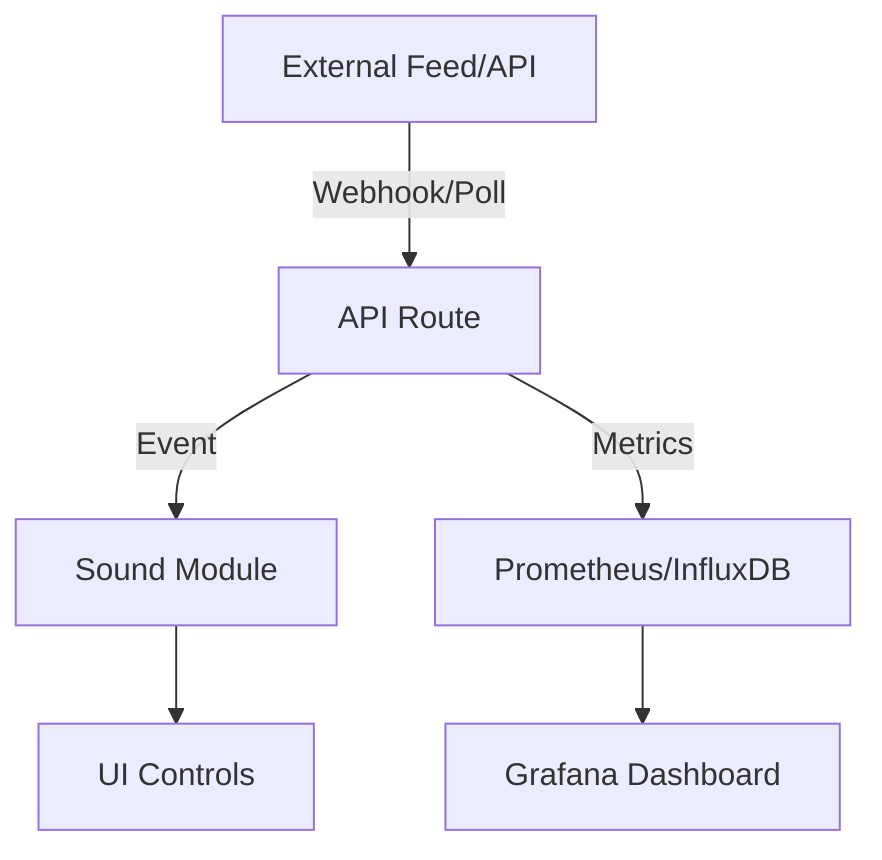

# Advanced Editing & Extension Guide: backend-radio-boilerplate

This guide provides actionable steps, code examples, and best practices for customizing, integrating, and deploying this boilerplate for radio-style, event-driven, or sonification projects.

---

## Design Principles & Architecture

- **Modular**: Each sound, feed, and UI feature is a separate module for easy extension.
- **Observable**: Built for metrics and dashboards (InfluxDB, Prometheus, Grafana).
- **API-First**: All logic is accessible via RESTful endpoints.
- **Testable**: Includes a Vitest suite for API endpoints (`/tests`).
- **Container-Ready**: Runs in Docker for local/cloud deployment.

### Architecture Overview



---

## How to Integrate a Feed

### 1. Add a New API Route
Create a new file:
```bash
touch app/api/feeds/route.ts
```
Example handler:
```typescript
// app/api/feeds/route.ts
import { NextResponse } from 'next/server'
export async function POST(request: Request) {
	const data = await request.json()
	// Process and store events
	return NextResponse.json({ success: true })
}
```

### 2. Webhook Integration
Point your external service to `/api/feeds`.

### 3. Polling Example
Use a cron job or serverless function to fetch data and POST to your API.

### 4. Persisting Events
Replace the in-memory store with InfluxDB/Postgres. See [InfluxDB Node.js Client](https://github.com/influxdata/influxdb-client-js).

---

## Adding New Sounds

### 1. Create a Sound Module
Edit `lib/sound-modules.ts`:
```typescript
export function playNewSound(event) {
	// Use Tone.js for synthesis
	// Example: Tone.Synth().toDestination().triggerAttackRelease('C4', '8n')
}
```

### 2. Add UI Controls
Edit `components/module-toggle.tsx`:
```tsx
<Switch checked={enabled} onCheckedChange={setEnabled} />
```

### 3. Map Events to Sounds
In your event handler or UI, call your new sound module when the relevant event arrives.

---

## Exposing Metrics for Prometheus

Add a new API route:
```typescript
// app/api/metrics/route.ts
import { NextResponse } from 'next/server'
export async function GET() {
	// Return Prometheus metrics as plain text
	return new Response('my_metric 1\n', { headers: { 'Content-Type': 'text/plain' } })
}
```

---

## Deploying

### Docker
```bash
docker build -t backend-radio-boilerplate .
docker run -p 3000:3000 backend-radio-boilerplate
```

### Cloud
- Deploy to Vercel, Azure, AWS, GCP, or any Docker-compatible host.
- Set environment variables for DB connections, secrets, etc.

---

## Troubleshooting & Tips

- **CORS Issues**: Edit API route responses to set CORS headers if integrating with external UIs.
- **Event Loss**: Use persistent storage for production (InfluxDB, Postgres, etc.).
- **Audio Not Playing**: Ensure browser autoplay policies are handled in the UI.
- **Metrics Not Scraped**: Check Prometheus config and endpoint exposure.

---

## Example Workflow: Add a Custom Event Feed & Sound
1. Create `app/api/feeds/route.ts` for new feed.
2. Add event processing logic and store events.
3. Edit `lib/sound-modules.ts` to add a new sound.
4. Add a toggle in `components/module-toggle.tsx`.
5. Map new event type to sound in the UI or backend.
6. Add a test in `/tests` for your new API route.
7. Deploy and monitor with Prometheus/Grafana.

---

## TODO List for a Production-Ready System
- [ ] Integrate persistent storage (InfluxDB, Postgres, etc.)
- [ ] Add authentication and authorization for API endpoints
- [ ] Add more sound modules and UI controls
- [ ] Improve event feed ingestion (webhooks, polling, etc.)
- [ ] Expose Prometheus metrics endpoint
- [ ] Add Grafana dashboard templates
- [ ] Add more API and integration tests
- [ ] Add documentation for custom event types and sound mapping
- [ ] Add CI/CD pipeline for automated deployment
- [ ] Add error handling and logging
- [ ] Provide example environment variable files

---

## References & Further Reading
- [Next.js API Routes](https://nextjs.org/docs/app/building-your-application/routing/router-handlers)
- [Tone.js Docs](https://tonejs.github.io/)
- [InfluxDB Node.js Client](https://github.com/influxdata/influxdb-client-js)
- [Prometheus Client for Node.js](https://github.com/siimon/prom-client)
- [Grafana Docs](https://grafana.com/docs/)
- [Vitest Docs](https://vitest.dev/)

---

## Contributing
- Fork, branch, and submit PRs for improvements.
- Add tests for new features.
- Document your changes.

---

## Questions?
Open an issue or discussion in your repository.
